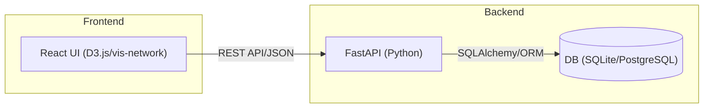

# 開発ステップ: relation-map

人物相関図Webアプリの開発ステップを以下にまとめます。
Docker Composeによる起動を前提とし、Webフレームワークは現代的な構成（例：React + FastAPI）を想定しています。

---

## システム全体構成（ブロック図）

---

## 1. 要件整理・設計
- [ ] 1.1 機能要件の洗い出し
	- UIでのノード/エッジ追加・編集・削除
	- 関係タイプ（友人・親子・上司部下など）の指定
	- データ保存・読込（永続化）
	- グラフのインタラクション（ドラッグ、ズーム、フィルタ等）
- [ ] 1.2 データモデル設計
	- Entity（人物・組織等）モデル定義
	- Relation（関係）モデル定義
	- API仕様設計（エンドポイント、リクエスト/レスポンス形式）

## 2. プロジェクト初期化
- [x] 2.1 リポジトリ構成決定・初期ディレクトリ作成
- [x] 2.2 backendセットアップ
	- FastAPIプロジェクト初期化
	- 必要パッケージ（FastAPI, Uvicorn, SQLAlchemy等）インストール
- [x] 2.3 frontendセットアップ
	- React + TypeScript プロジェクト初期化
	- グラフ描画ライブラリ導入（D3.jsまたはvis-network）
- [x] 2.4 docker-compose.yml作成
	- backend, frontend, DBサービスの定義

## 3. 最小構成の実装
- [x] 3.1 APIサーバー
	- [x] 3.1.1 Entity/RelationのCRUDエンドポイント実装
	- [x] 3.1.2 CORS設定
- [x] 3.2 フロントエンド
	- [x] 3.2.1 サンプルデータでグラフ描画
	- [x] 3.2.2 APIからデータ取得・表示

## 4. UI機能拡張
- [x] 4.1 ノード/エッジの追加・編集・削除UI
- [x] 4.2 関係タイプの選択・表示
- [x] 4.3 キャンバスのドラッグ・ズーム
- [x] 4.4 入力バリデーション・エラーハンドリング

## 5. データ保存・読込
**[詳細設計書](feature5_design.md) | [実装完了サマリー](feature5_implementation_summary.md) を参照**
- [x] 5.1 サーバー側でデータ永続化（SQLite/PostgreSQL）
- [x] 5.2 フロントエンドからAPI経由でデータ保存・取得
- [x] 5.3 データ初期化・リセット機能（/reset エンドポイント追加）
- [x] 5.4 サンプルデータからの移行改善（ユーザー追加時に自動的にAPI保存）

## 6. Docker Compose統合
- [ ] 6.1 backend, frontend, DBのサービスをdocker-composeで一括起動
- [ ] 6.2 READMEに起動手順を記載

## 7. 追加機能・改善
- [ ] 7.1 データのエクスポート/インポート（JSON等）
- [ ] 7.2 UI/UX改善（フィルタ、検索、スタイリングなど）
- [ ] 7.3 テスト（ユニット・E2E）
- [ ] 7.4 ドキュメント整備
- [ ] 7.5 バージョン管理（履歴の保存）
- [ ] 7.6 複数プロジェクト対応
- [ ] 7.7 リアルタイム同期（WebSocket）
- [ ] 7.8 ユーザー認証・認可

