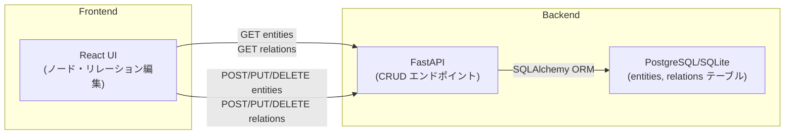

# 機能5: データ保存・読込 設計書

## 概要
relation-mapアプリケーションのノード（Entity）とリレーション（Relation）データをデータベースに永続化し、フロントエンドから保存・読込を行うための仕様設計です。

---

## 1. 全体構成

### 1.1 データフロー



---

## 2. データモデル仕様

### 2.1 Entity テーブル構造

| カラム | 型 | 説明 |
|--------|-----|------|
| id | Integer (PK) | エンティティID（自動採番） |
| name | String | エンティティ名（例：「太郎」） |
| type | String | エンティティ種別（例：'person', 'organization'） |
| description | String (Nullable) | 説明 |

### 2.2 Relation テーブル構造

| カラム | 型 | 説明 |
|--------|-----|------|
| id | Integer (PK) | リレーションID（自動採番） |
| source_id | Integer (FK) | ソースエンティティID |
| target_id | Integer (FK) | ターゲットエンティティID |
| relation_type | String | リレーション種別（例：'friend', 'parent'） |
| description | String (Nullable) | 説明 |

---

## 3. API仕様

### 3.1 Entity エンドポイント

#### POST /entities/
**目的**: 新しいエンティティを作成

**リクエスト**:
```json
{
  "name": "太郎",
  "type": "person",
  "description": "主人公"
}
```

**レスポンス** (200):
```json
{
  "id": 1,
  "name": "太郎",
  "type": "person",
  "description": "主人公"
}
```

#### GET /entities/
**目的**: 全エンティティ取得

**クエリパラメータ**:
- `skip`: int (default: 0)
- `limit`: int (default: 100)

**レスポンス** (200):
```json
[
  { "id": 1, "name": "太郎", "type": "person", "description": "主人公" },
  { "id": 2, "name": "花子", "type": "person", "description": "ヒロイン" }
]
```

#### GET /entities/{entity_id}
**目的**: 特定のエンティティを取得

**レスポンス** (200):
```json
{
  "id": 1,
  "name": "太郎",
  "type": "person",
  "description": "主人公"
}
```

#### PUT /entities/{entity_id}
**目的**: エンティティを更新

**リクエスト**:
```json
{
  "name": "太郎（更新）",
  "type": "person",
  "description": "更新された説明"
}
```

**レスポンス** (200): 更新されたエンティティオブジェクト

#### DELETE /entities/{entity_id}
**目的**: エンティティを削除

**レスポンス** (200):
```json
{ "ok": true }
```

### 3.2 Relation エンドポイント

#### POST /relations/
**目的**: 新しいリレーションを作成

**リクエスト**:
```json
{
  "source_id": 1,
  "target_id": 2,
  "relation_type": "friend",
  "description": "友人関係"
}
```

**レスポンス** (200): 作成されたリレーションオブジェクト

#### GET /relations/
**目的**: 全リレーション取得

**クエリパラメータ**:
- `skip`: int (default: 0)
- `limit`: int (default: 100)

**レスポンス** (200): リレーション配列

#### GET /relations/{relation_id}
**目的**: 特定のリレーションを取得

**レスポンス** (200): リレーションオブジェクト

#### PUT /relations/{relation_id}
**目的**: リレーションを更新

**リクエスト**: リレーションオブジェクト

**レスポンス** (200): 更新されたリレーションオブジェクト

#### DELETE /relations/{relation_id}
**目的**: リレーションを削除

**レスポンス** (200):
```json
{ "ok": true }
```

---

## 4. フロントエンド実装要件

### 4.1 初期ロード

1. アプリケーション起動時に `GET /entities/` と `GET /relations/` を実行
2. データベースにデータがある場合 → DBから読み込んだデータを表示
3. データが空の場合 → サンプルデータを表示

### 4.2 データ保存フロー

#### ノード追加時
```
1. ユーザが "ノード追加" をクリック
  ↓
2. EntityModal で入力
  ↓
3. POST /entities/ でサーバーに送信
  ↓
4. レスポンスで id を取得
  ↓
5. GET /entities/ で全データを再取得
  ↓
6. UI を再描画
```

#### ノード編集時
```
1. ユーザが編集ボタンをクリック
  ↓
2. EntityModal で修正
  ↓
3. PUT /entities/{id} でサーバーに送信
  ↓
4. GET /entities/ で全データを再取得
  ↓
5. UI を再描画
```

#### ノード削除時
```
1. ユーザが削除ボタンをクリック
  ↓
2. 確認ダイアログ表示
  ↓
3. DELETE /entities/{id} でサーバーに送信
  ↓
4. 関連する Relation も削除するか検討
  ↓
5. GET /entities/ で全データを再取得
  ↓
6. UI を再描画
```

リレーションについても同様。

### 4.3 UI表示

- **データ状態の表示**
  - DB からのデータ取得成功時 → 通常表示
  - DB にデータがない場合 → サンプルデータ表示（警告メッセージ付き）
  
現在の実装:
```
isUsingSampleData = apiEntities.length === 0;
⚠️ サンプルデータを使用中。変更はローカルのみで保存されません。
```

---

## 5. 新機能: データ初期化・リセット

### 5.1 エンドポイント追加

#### POST /reset
**目的**: すべてのデータをリセット

**レスポンス** (200):
```json
{ "ok": true, "message": "All data has been reset" }
```

**処理**:
- entities テーブルを空にする
- relations テーブルを空にする

実装方法:
```python
@router.post("/reset")
def reset_data(database: Session = Depends(get_db)):
    database.query(models.Relation).delete()
    database.query(models.Entity).delete()
    database.commit()
    return {"ok": True, "message": "All data has been reset"}
```

### 5.2 フロントエンド機能

- リセットボタンをUIに追加
- 確認ダイアログを表示
- POST /reset を実行
- データを再取得

UIの配置案:
```
[ノード追加] [リレーション追加] [データをリセット]
```

---

## 6. エラーハンドリング仕様

### 6.1 バックエンド

- **404 Not Found**: 指定されたエンティティ/リレーションが存在しない
- **400 Bad Request**: リクエストボディが不正
- **500 Internal Server Error**: データベースエラー等

### 6.2 フロントエンド

すべての API 呼び出しに try-catch を実装

```typescript
try {
  await createEntity(data);
  await refetchEntities();
} catch (err) {
  console.error("Failed to save entity:", err);
  // ユーザーにエラーメッセージを表示（Toast等）
}
```

---

## 7. 実装の進め方

### Phase 1: バックエンド準備
- [ ] 7.1 models.py を確認（Entity, Relation モデル定義）
- [ ] 7.2 db.py を確認（データベース接続設定）
- [ ] 7.3 api.py を確認（CRUD エンドポイント実装）
- [ ] 7.4 /reset エンドポイントを追加実装

### Phase 2: フロントエンド連携テスト
- [ ] 7.5 Dockerfile でイメージビルド確認
- [ ] 7.6 docker-compose.yml でサービス起動確認
- [ ] 7.7 API呼び出しのテスト（DevTools の Network タブで確認）

### Phase 3: フロントエンド機能追加
- [ ] 7.8 リセット機能を UI に追加
- [ ] 7.9 エラーハンドリング改善（Toast通知等）
- [ ] 7.10 ローディング状態表示（スピナー等）

### Phase 4: 動作確認・修正
- [ ] 7.11 E2E テスト（UI から追加→編集→削除→リセット の一連の操作）
- [ ] 7.12 エラーケーステスト
- [ ] 7.13 ドキュメント更新

---

## 8. 技術スタック確認

| 項目 | 技術 |
|------|-----|
| **Backend** | FastAPI (Python) |
| **Database** | PostgreSQL / SQLite |
| **ORM** | SQLAlchemy |
| **Frontend** | React + TypeScript |
| **HTTP Client** | Fetch API |
| **Containerization** | Docker, Docker Compose |

---

## 9. 補足事項

### 9.1 Cascadeルール検討

エンティティを削除する際、関連するリレーションを自動削除するか、手動で処理するか。

**案A: 自動削除（Cascade）**
- 自動的に関連リレーションも削除
- 実装: `relationship(..., cascade="all, delete-orphan")`

**案B: 手動削除**
- フロントエンドで削除時に確認
- 関連リレーションをリストアップして削除

現在の実装では案B（手動削除）で対応している。

### 9.2 トランザクション処理

複数のエンティティ/リレーションを同時に追加する場合の一括処理は、
Phase 7 など後期段階で検討するのが良い。

### 9.3 将来の拡張

- [ ] バージョン管理（履歴の保存）
- [ ] 複数プロジェクト対応
- [ ] データのエクスポート/インポート（JSON等）
- [ ] リアルタイム同期（WebSocket）
- [ ] ユーザー認証・認可

