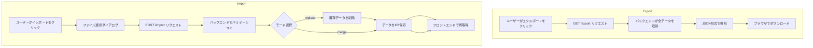
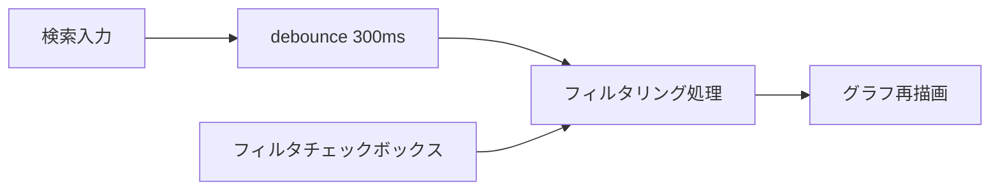

# 機能7.1: 基本機能の完成度向上 設計書

## 概要
relation-mapアプリケーションの基本機能を完成させ、実用性と使いやすさを向上させる機能群の設計です。以下の3つのサブ機能を含みます：

1. **データのエクスポート/インポート（JSON等）**
2. **UI/UX改善（フィルタ、検索、スタイリングなど）**
3. **ドキュメント整備**

---

## 1. データのエクスポート/インポート

### 1.1 目的
- ユーザーが作成した相関図データをバックアップ・共有できるようにする
- 他の環境への移行やデータの再利用を可能にする
- JSON形式で人間にも読みやすく、編集可能な形式で保存

### 1.2 データフォーマット仕様

#### エクスポートされるJSON構造
```json
{
  "version": "1.0",
  "exported_at": "2026-02-01T10:30:00Z",
  "entities": [
    {
      "id": 1,
      "name": "太郎",
      "type": "person",
      "description": "主人公"
    },
    {
      "id": 2,
      "name": "花子",
      "type": "person",
      "description": "ヒロイン"
    }
  ],
  "relations": [
    {
      "id": 1,
      "source_id": 1,
      "target_id": 2,
      "relation_type": "friend",
      "description": "友人関係"
    }
  ]
}
```

**フィールド説明**:
- `version`: データフォーマットのバージョン（将来の互換性のため）
- `exported_at`: エクスポート日時（ISO 8601形式）
- `entities`: エンティティの配列
- `relations`: リレーションの配列

### 1.3 API仕様

#### GET /export
**目的**: 全データをJSON形式でエクスポート

**レスポンス** (200):
```json
{
  "version": "1.0",
  "exported_at": "2026-02-01T10:30:00Z",
  "entities": [...],
  "relations": [...]
}
```

**ヘッダー**:
- `Content-Type: application/json`
- `Content-Disposition: attachment; filename="relation-map-export-20260201.json"`

#### POST /import
**目的**: JSON形式のデータをインポート

**リクエストボディ**:
```json
{
  "version": "1.0",
  "entities": [...],
  "relations": [...]
}
```

**オプションパラメータ（クエリパラメータ）**:
- `mode`: 'merge' | 'replace' (default: 'merge')
  - `merge`: 既存データに追加（ID競合時は新規IDを採番）
  - `replace`: 既存データをすべて削除してからインポート

**レスポンス** (200):
```json
{
  "ok": true,
  "imported_entities": 5,
  "imported_relations": 8,
  "skipped": 0
}
```

**エラーレスポンス** (400):
```json
{
  "detail": "Invalid format: missing 'entities' field"
}
```

### 1.4 フロントエンド実装

#### エクスポート機能
```typescript
const handleExport = async () => {
  const response = await fetch(`${API_URL}/export`);
  const blob = await response.blob();
  const url = window.URL.createObjectURL(blob);
  const a = document.createElement('a');
  a.href = url;
  a.download = `relation-map-${new Date().toISOString().split('T')[0]}.json`;
  document.body.appendChild(a);
  a.click();
  a.remove();
};
```

#### インポート機能
```typescript
const handleImport = async (file: File, mode: 'merge' | 'replace' = 'merge') => {
  const formData = new FormData();
  formData.append('file', file);
  
  const response = await fetch(`${API_URL}/import?mode=${mode}`, {
    method: 'POST',
    body: formData
  });
  
  if (!response.ok) {
    throw new Error('Import failed');
  }
  
  const result = await response.json();
  await refetchEntities();
  await refetchRelations();
  return result;
};
```

#### UI配置
```
[ノード追加] [リレーション追加] [エクスポート▼] [インポート] [データをリセット]
                                        |
                                        +-- JSON形式でダウンロード
                                        +-- PNG画像でエクスポート（将来）
```

---

## 2. UI/UX改善

### 2.1 検索・フィルタ機能

#### 2.1.1 エンティティ検索
**目的**: 多数のノードから特定のエンティティを素早く見つける

**機能仕様**:
- リアルタイム検索（入力に応じて候補を絞り込み）
- 検索対象フィールド: name, type, description
- 部分一致検索（大文字小文字を区別しない）
- 検索結果をグラフ上でハイライト表示

**UI設計**:
```
┌─────────────────────────────────────┐
│ 🔍 検索: [____________] [×]         │
└─────────────────────────────────────┘
```

**実装イメージ**:
```typescript
const [searchQuery, setSearchQuery] = useState('');

const filteredEntities = entities.filter(entity => 
  entity.name.toLowerCase().includes(searchQuery.toLowerCase()) ||
  entity.type.toLowerCase().includes(searchQuery.toLowerCase()) ||
  (entity.description || '').toLowerCase().includes(searchQuery.toLowerCase())
);
```

#### 2.1.2 関係タイプフィルタ
**目的**: 特定の関係タイプのみを表示して視認性を向上

**機能仕様**:
- 関係タイプごとのチェックボックス
- 複数選択可能
- デフォルトは全選択状態

**UI設計**:
```
┌─────────────────────────────────────┐
│ 表示する関係タイプ:                 │
│ ☑ 友人 ☑ 親子 ☑ 上司部下 ☑ その他   │
└─────────────────────────────────────┘
```

**実装イメージ**:
```typescript
const [visibleRelationTypes, setVisibleRelationTypes] = useState<Set<string>>(
  new Set(['friend', 'parent', 'boss', 'other'])
);

const filteredRelations = relations.filter(relation => 
  visibleRelationTypes.has(relation.relation_type)
);
```

#### 2.1.3 エンティティタイプフィルタ
**目的**: 人物・組織など特定のエンティティタイプのみ表示

**機能仕様**:
- タイプごとのチェックボックス
- 複数選択可能

**UI設計**:
```
┌─────────────────────────────────────┐
│ 表示するノードタイプ:               │
│ ☑ 人物 ☑ 組織 ☑ その他              │
└─────────────────────────────────────┘
```

### 2.2 スタイリング改善

#### 2.2.1 デザインシステムの導入
**目的**: 一貫性のある見た目と使いやすいUI

**カラーパレット**:
```css
/* プライマリーカラー */
--color-primary: #4DA1FF;
--color-primary-dark: #3A7ACD;
--color-primary-light: #7BBFFF;

/* セマンティックカラー */
--color-success: #4CAF50;
--color-warning: #FF9800;
--color-danger: #F44336;
--color-info: #2196F3;

/* ニュートラルカラー */
--color-bg: #FFFFFF;
--color-bg-secondary: #F5F5F5;
--color-border: #E0E0E0;
--color-text: #212121;
--color-text-secondary: #757575;

/* エンティティタイプ別カラー */
--color-person: #4DA1FF;
--color-organization: #9C27B0;
--color-place: #4CAF50;
--color-other: #757575;
```

#### 2.2.2 ノードスタイル
**仕様**:
- エンティティタイプによって色分け
- 選択時にハイライト効果
- ホバー時に情報を表示

**実装イメージ**:
```typescript
const getNodeColor = (type: string): string => {
  const colorMap: Record<string, string> = {
    'person': '#4DA1FF',
    'organization': '#9C27B0',
    'place': '#4CAF50',
    'other': '#757575'
  };
  return colorMap[type] || colorMap['other'];
};
```

#### 2.2.3 エッジスタイル
**仕様**:
- 関係タイプによって色分け
- 矢印の形状で方向性を表現
- ラベルを表示

**実装イメージ**:
```typescript
const getEdgeColor = (relationType: string): string => {
  const colorMap: Record<string, string> = {
    'friend': '#4CAF50',
    'parent': '#2196F3',
    'boss': '#FF9800',
    'enemy': '#F44336',
    'other': '#757575'
  };
  return colorMap[relationType] || colorMap['other'];
};
```

### 2.3 レスポンシブデザイン

#### 2.3.1 目的
- タブレット・モバイルデバイスでも使いやすいUI

#### 2.3.2 ブレークポイント
```css
/* デスクトップ: 1200px以上 */
@media (min-width: 1200px) {
  /* サイドバーとメインエリアを横並び */
}

/* タブレット: 768px〜1199px */
@media (min-width: 768px) and (max-width: 1199px) {
  /* サイドバーを折りたたみ可能に */
}

/* モバイル: 767px以下 */
@media (max-width: 767px) {
  /* サイドバーをオーバーレイ表示 */
  /* ボタンを縦並びに */
}
```

### 2.4 アクセシビリティ改善

#### 2.4.1 キーボード操作
- Tab キーでフォーカス移動
- Enter キーで選択・決定
- Esc キーでモーダルを閉じる

#### 2.4.2 ARIA属性
```html
<button 
  aria-label="ノードを追加" 
  aria-describedby="add-node-help"
>
  + ノードを追加
</button>
```

#### 2.4.3 カラーコントラスト
- WCAG 2.1 AA基準を満たすコントラスト比（4.5:1以上）

### 2.5 パフォーマンス改善

#### 2.5.1 仮想化（大量データ対応）
**目的**: 100件以上のノード・エッジでもスムーズに動作

**実装方針**:
- リストの仮想化（react-window 等を使用）
- グラフの描画最適化（visible エリアのみ描画）

#### 2.5.2 デバウンス・スロットリング
**目的**: 検索やフィルタのパフォーマンス向上

```typescript
import { debounce } from 'lodash';

const debouncedSearch = debounce((query: string) => {
  setSearchQuery(query);
}, 300);
```

### 2.6 タイプ管理機能

#### 2.6.1 目的
- エンティティタイプとリレーションタイプを一元管理
- タイプの追加・編集・削除を効率的に行う
- 既存データのタイプを一括で変更または削除

#### 2.6.2 機能仕様

**タイプの入力補助**:
- HTML5の`<datalist>`要素を使用
- 既存のタイプから選択可能
- 新しいタイプも自由に入力可能
- 入力フィールドに候補が表示される

**タイプ管理ダイアログ**:
- サイドバーの「📋 タイプ管理」ボタンからアクセス
- エンティティタイプ一覧を表示（使用数付き）
- リレーションタイプ一覧を表示（使用数付き）
- 各タイプに対してリネームと削除が可能

**タイプのリネーム（一括更新）**:
- ✏️ボタンをクリックしてインライン編集
- 新しいタイプ名を入力して保存
- 該当するすべてのエンティティ/リレーションのタイプが一括で更新される
- 例: "Person" → "人物" に変更すると、5件すべてが更新される

**タイプの削除（一括削除）**:
- 🗑️ボタンをクリックして削除確認
- 確認ダイアログに削除される件数を表示
- エンティティタイプ削除時は関連リレーションも削除される
- リレーションタイプ削除時は該当するリレーションのみ削除

#### 2.6.3 API仕様

**PUT /entities/types/{old_type}**
- クエリパラメータ: `new_type` (string, required)
- 説明: エンティティタイプのリネーム（一括更新）

**DELETE /entities/types/{type_name}**
- 説明: 指定したタイプのエンティティと関連リレーションを一括削除

**PUT /relations/types/{old_type}**
- クエリパラメータ: `new_type` (string, required)
- 説明: リレーションタイプのリネーム（一括更新）

**DELETE /relations/types/{type_name}**
- 説明: 指定したタイプのリレーションを一括削除

---

## 3. ドキュメント整備

### 3.1 README.md 拡張

#### 3.1.1 追加セクション

**使い方ガイド**:
```markdown
## 使い方

### 基本操作
1. ノードの追加
   - [+ ノードを追加] ボタンをクリック
   - 名前、タイプ、説明を入力
   - [保存] をクリック

2. リレーションの追加
   - [+ リレーションを追加] ボタンをクリック
   - ソースとターゲットのノードを選択
   - リレーションタイプを選択
   - [保存] をクリック

3. データのエクスポート
   - [エクスポート] ボタンをクリック
   - JSON ファイルがダウンロードされます

4. データのインポート
   - [インポート] ボタンをクリック
   - JSON ファイルを選択
   - インポートモード（追加/置換）を選択
```

**トラブルシューティング**:
```markdown
## トラブルシューティング

### よくある問題

#### Q: グラフが表示されない
A: ブラウザのコンソールでエラーを確認してください。
   バックエンドが起動しているか確認してください。

#### Q: データが保存されない
A: データベースの接続を確認してください。
   docker-compose logs backend でログを確認してください。

#### Q: インポートが失敗する
A: JSON ファイルの形式が正しいか確認してください。
```

### 3.2 API ドキュメント

#### 3.2.1 OpenAPI (Swagger) 自動生成
FastAPI の自動ドキュメント生成機能を活用

アクセス方法:
- Swagger UI: `http://localhost:8000/docs`
- ReDoc: `http://localhost:8000/redoc`

#### 3.2.2 APIリファレンス作成

**docs/api-reference.md** を作成:
```markdown
# API リファレンス

## エンドポイント一覧

### Entity 管理
- `GET /entities/` - エンティティ一覧取得
- `POST /entities/` - エンティティ作成
- `GET /entities/{id}` - エンティティ詳細取得
- `PUT /entities/{id}` - エンティティ更新
- `DELETE /entities/{id}` - エンティティ削除

### Relation 管理
- `GET /relations/` - リレーション一覧取得
- `POST /relations/` - リレーション作成
- `GET /relations/{id}` - リレーション詳細取得
- `PUT /relations/{id}` - リレーション更新
- `DELETE /relations/{id}` - リレーション削除

### データ管理
- `POST /reset` - 全データリセット
- `GET /export` - データエクスポート
- `POST /import` - データインポート
```

### 3.3 アーキテクチャドキュメント

**docs/architecture.md** を作成:
```markdown
# システムアーキテクチャ

## 概要
relation-map は React + FastAPI + PostgreSQL で構成される
単一ページアプリケーション（SPA）です。

## コンポーネント構成

### フロントエンド
- **技術スタック**: React 18, TypeScript, D3.js
- **主要コンポーネント**:
  - `App.tsx`: メインコンポーネント
  - `Graph.tsx`: グラフ描画コンポーネント
  - `EntityModal.tsx`: エンティティ追加・編集モーダル
  - `RelationModal.tsx`: リレーション追加・編集モーダル
  - `ConfirmDialog.tsx`: 確認ダイアログ

### バックエンド
- **技術スタック**: FastAPI, SQLAlchemy, PostgreSQL
- **主要モジュール**:
  - `main.py`: アプリケーションエントリーポイント
  - `api.py`: API エンドポイント定義
  - `models.py`: データモデル定義
  - `schemas.py`: Pydantic スキーマ定義
  - `db.py`: データベース接続設定

### データベース
- **RDBMS**: PostgreSQL (開発環境では SQLite も可)
- **テーブル**:
  - `entities`: エンティティ情報
  - `relations`: リレーション情報

## データフロー
[ここに Mermaid 図を挿入]
```

### 3.4 コントリビューションガイド

**CONTRIBUTING.md** を作成:
```markdown
# コントリビューションガイド

## 開発環境のセットアップ

### 前提条件
- Docker Desktop がインストールされていること
- Git がインストールされていること

### セットアップ手順
1. リポジトリをクローン
   ```bash
   git clone https://github.com/your-org/relation-map.git
   cd relation-map
   ```

2. Docker Compose で起動
   ```bash
   docker compose up --build
   ```

3. ブラウザでアクセス
   - フロントエンド: http://localhost:3000
   - バックエンド API: http://localhost:8000
   - API ドキュメント: http://localhost:8000/docs

## コーディング規約

### TypeScript / React
- ESLint + Prettier を使用
- コンポーネントは関数コンポーネントで実装
- Props の型定義を必ず行う

### Python / FastAPI
- PEP 8 に準拠
- Type hints を使用
- Docstring を記述（Google スタイル）

## プルリクエスト

### プルリクエストの作成
1. feature ブランチを作成
2. 変更をコミット
3. プルリクエストを作成
4. レビューを待つ

### コミットメッセージ
- Conventional Commits に準拠
- 例: `feat: add export functionality`
- 種類: feat, fix, docs, style, refactor, test, chore
```

### 3.5 チュートリアル動画・スクリーンショット

#### 3.5.1 スクリーンショット用ディレクトリ
```
docs/
  images/
    screenshot-main.png
    screenshot-add-node.png
    screenshot-add-relation.png
    screenshot-export.png
```

#### 3.5.2 README への埋め込み
```markdown
## スクリーンショット

### メイン画面


### ノード追加

```

---

## 4. データフロー図

### 4.1 エクスポート/インポートフロー



### 4.2 検索・フィルタフロー



---

## 5. 実装の進め方

### Phase 1: エクスポート/インポート機能
- [ ] 5.1 バックエンド: GET /export エンドポイント実装
- [ ] 5.2 バックエンド: POST /import エンドポイント実装
- [ ] 5.3 フロントエンド: エクスポートボタン・ロジック実装
- [ ] 5.4 フロントエンド: インポートボタン・ロジック実装
- [ ] 5.5 エラーハンドリング・バリデーション追加
- [ ] 5.6 動作確認（E2Eテスト）

### Phase 2: 検索・フィルタ機能
- [ ] 5.7 フロントエンド: 検索入力コンポーネント追加
- [ ] 5.8 フロントエンド: 検索ロジック実装（debounce）
- [ ] 5.9 フロントエンド: 関係タイプフィルタ UI 追加
- [ ] 5.10 フロントエンド: エンティティタイプフィルタ UI 追加
- [ ] 5.11 グラフコンポーネントにフィルタ機能統合
- [ ] 5.12 動作確認

### Phase 3: スタイリング改善
- [ ] 5.13 CSS変数でカラーパレット定義
- [ ] 5.14 ノード・エッジのスタイル改善
- [ ] 5.15 レスポンシブデザイン対応
- [ ] 5.16 アクセシビリティ対応（ARIA属性追加）
- [ ] 5.17 各デバイスで動作確認

### Phase 4: パフォーマンス改善
- [ ] 5.18 検索のデバウンス実装
- [ ] 5.19 リストの仮想化検討・実装（必要に応じて）
- [ ] 5.20 グラフ描画の最適化
- [ ] 5.21 パフォーマンステスト

### Phase 5: ドキュメント整備
- [ ] 5.22 README.md 拡張（使い方ガイド追加）
- [ ] 5.23 API リファレンス作成
- [ ] 5.24 アーキテクチャドキュメント作成
- [ ] 5.25 CONTRIBUTING.md 作成
- [ ] 5.26 スクリーンショット撮影・追加
- [ ] 5.27 トラブルシューティングセクション追加

---

## 6. エラーハンドリング仕様

### 6.1 エクスポート時
```python
@router.get("/export")
def export_data(database: Session = Depends(get_db)):
    try:
        entities = database.query(models.Entity).all()
        relations = database.query(models.Relation).all()
        
        data = {
            "version": "1.0",
            "exported_at": datetime.utcnow().isoformat() + "Z",
            "entities": [schemas.Entity.from_orm(e).dict() for e in entities],
            "relations": [schemas.Relation.from_orm(r).dict() for r in relations]
        }
        
        return data
    except Exception as e:
        raise HTTPException(status_code=500, detail=f"Export failed: {str(e)}")
```

### 6.2 インポート時
```python
@router.post("/import")
def import_data(
    data: dict,
    mode: str = Query(default="merge", regex="^(merge|replace)$"),
    database: Session = Depends(get_db)
):
    try:
        # バリデーション
        if "entities" not in data or "relations" not in data:
            raise HTTPException(status_code=400, detail="Invalid format")
        
        if mode == "replace":
            # 既存データ削除
            database.query(models.Relation).delete()
            database.query(models.Entity).delete()
        
        # インポート処理
        entity_id_map = {}  # 旧ID → 新ID のマッピング
        
        for entity_data in data["entities"]:
            old_id = entity_data.pop("id", None)
            new_entity = models.Entity(**entity_data)
            database.add(new_entity)
            database.flush()
            if old_id:
                entity_id_map[old_id] = new_entity.id
        
        for relation_data in data["relations"]:
            relation_data.pop("id", None)
            # IDマッピングを適用
            if relation_data["source_id"] in entity_id_map:
                relation_data["source_id"] = entity_id_map[relation_data["source_id"]]
            if relation_data["target_id"] in entity_id_map:
                relation_data["target_id"] = entity_id_map[relation_data["target_id"]]
            
            new_relation = models.Relation(**relation_data)
            database.add(new_relation)
        
        database.commit()
        
        return {
            "ok": True,
            "imported_entities": len(data["entities"]),
            "imported_relations": len(data["relations"]),
            "skipped": 0
        }
    except Exception as e:
        database.rollback()
        raise HTTPException(status_code=500, detail=f"Import failed: {str(e)}")
```

### 6.3 フロントエンドエラーハンドリング
```typescript
try {
  const result = await handleImport(file, 'merge');
  alert(`インポート成功: ${result.imported_entities} エンティティ, ${result.imported_relations} リレーション`);
} catch (error) {
  console.error('Import error:', error);
  alert('インポートに失敗しました。ファイル形式を確認してください。');
}
```

---

## 7. テスト仕様

### 7.1 エクスポート/インポート機能のテスト

#### 7.1.1 単体テスト（バックエンド）
```python
def test_export_empty_database():
    """空のデータベースのエクスポートテスト"""
    response = client.get("/export")
    assert response.status_code == 200
    data = response.json()
    assert data["version"] == "1.0"
    assert len(data["entities"]) == 0
    assert len(data["relations"]) == 0

def test_import_valid_data():
    """正常なデータのインポートテスト"""
    data = {
        "version": "1.0",
        "entities": [
            {"name": "太郎", "type": "person", "description": "主人公"}
        ],
        "relations": []
    }
    response = client.post("/import", json=data)
    assert response.status_code == 200
    assert response.json()["imported_entities"] == 1

def test_import_invalid_format():
    """不正な形式のデータのインポートテスト"""
    data = {"invalid": "format"}
    response = client.post("/import", json=data)
    assert response.status_code == 400
```

#### 7.1.2 E2Eテスト（フロントエンド）
```typescript
describe('Export/Import functionality', () => {
  it('should export data', async () => {
    // ノードを追加
    await addEntity({ name: 'テスト', type: 'person', description: '' });
    
    // エクスポートボタンをクリック
    const exportButton = screen.getByText(/エクスポート/);
    fireEvent.click(exportButton);
    
    // ダウンロードが開始されることを確認
    // ...
  });
  
  it('should import data', async () => {
    // インポートボタンをクリック
    const importButton = screen.getByText(/インポート/);
    fireEvent.click(importButton);
    
    // ファイルを選択
    const file = new File([JSON.stringify(testData)], 'test.json', {
      type: 'application/json'
    });
    const input = screen.getByLabelText(/ファイルを選択/);
    fireEvent.change(input, { target: { files: [file] } });
    
    // インポート実行
    const submitButton = screen.getByText(/インポート実行/);
    fireEvent.click(submitButton);
    
    // データが表示されることを確認
    await waitFor(() => {
      expect(screen.getByText(/太郎/)).toBeInTheDocument();
    });
  });
});
```

### 7.2 検索・フィルタ機能のテスト

#### 7.2.1 単体テスト（フロントエンド）
```typescript
describe('Search functionality', () => {
  it('should filter entities by name', () => {
    const entities = [
      { id: 1, name: '太郎', type: 'person', description: '' },
      { id: 2, name: '花子', type: 'person', description: '' }
    ];
    
    const filtered = filterEntities(entities, '太郎');
    expect(filtered).toHaveLength(1);
    expect(filtered[0].name).toBe('太郎');
  });
  
  it('should filter relations by type', () => {
    const relations = [
      { id: 1, source_id: 1, target_id: 2, relation_type: 'friend', description: '' },
      { id: 2, source_id: 1, target_id: 3, relation_type: 'parent', description: '' }
    ];
    
    const filtered = filterRelations(relations, new Set(['friend']));
    expect(filtered).toHaveLength(1);
    expect(filtered[0].relation_type).toBe('friend');
  });
});
```

---

## 8. 技術スタック

| 項目 | 技術 | 用途 |
|------|-----|------|
| **バックエンド** | FastAPI 0.100+ | REST API サーバー |
| **データベース** | PostgreSQL 14+ | データ永続化 |
| **ORM** | SQLAlchemy 2.0+ | データベース操作 |
| **フロントエンド** | React 18 | UI フレームワーク |
| **言語** | TypeScript 5.0+ | 型安全性 |
| **グラフ描画** | D3.js v7 | グラフビジュアライゼーション |
| **ビルドツール** | Create React App | フロントエンド開発環境 |
| **コンテナ** | Docker, Docker Compose | 開発・デプロイ環境 |
| **テスト** | pytest (backend), Jest (frontend) | 自動テスト |
| **ユーティリティ** | lodash | debounce 等のユーティリティ |

---

## 9. 補足事項

### 9.1 将来の拡張案

#### 9.1.1 画像エクスポート
- グラフを PNG/SVG 形式で出力
- html2canvas または SVG エクスポート機能を使用

#### 9.1.2 高度な検索機能
- AND/OR/NOT を組み合わせたクエリ
- 正規表現検索
- 保存した検索条件の再利用

#### 9.1.3 テーマ機能
- ライト/ダークモード切り替え
- カスタムカラースキーム

### 9.2 パフォーマンス目標

| 指標 | 目標値 |
|------|--------|
| 初期ロード時間 | < 2秒 |
| 検索レスポンス | < 100ms |
| グラフ描画（100ノード） | < 500ms |
| エクスポート（1000件） | < 3秒 |
| インポート（1000件） | < 5秒 |

### 9.3 ブラウザサポート

| ブラウザ | バージョン |
|----------|------------|
| Chrome | 最新2バージョン |
| Firefox | 最新2バージョン |
| Safari | 最新2バージョン |
| Edge | 最新2バージョン |

### 9.4 アクセシビリティ基準

- WCAG 2.1 AA 準拠を目標
- キーボード操作の完全サポート
- スクリーンリーダー対応

---

## 10. まとめ

本設計書では、relation-map の基本機能を完成させるための3つの主要機能を定義しました：

1. **エクスポート/インポート**: データのバックアップ・共有機能
2. **UI/UX改善**: 検索・フィルタ・スタイリング・パフォーマンス向上
3. **ドキュメント整備**: ユーザー・開発者向けドキュメントの充実

これらの機能により、アプリケーションの実用性と使いやすさが大幅に向上し、
より多くのユーザーに利用してもらえる基盤が整います。

Phase 1〜5 の実装を順次進めることで、段階的に機能を追加し、
各段階でテストと検証を行いながら品質を確保していきます。
