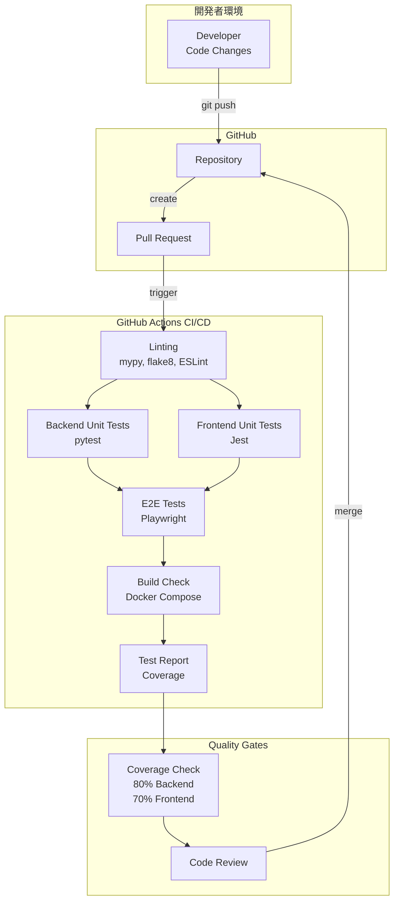

# Feature 7.2: 品質・保守性向上 - 詳細設計書

**作成日**: 2026年2月1日  
**対象バージョン**: 0.2.0  
**ステータス**: 設計中

---

## 1. 概要

本機能では、Relation Mapプロジェクトの品質と保守性を向上させるため、包括的なテスト戦略とCI/CDパイプラインを導入します。これにより、継続的な品質保証、リグレッション防止、および安全なデプロイメントプロセスを確立します。

## 2. 目標

### 2.1 主要目標
- **品質保証**: 自動テストによる機能の正確性検証
- **リグレッション防止**: コード変更時の既存機能への影響を自動検出
- **保守性向上**: テストコードによるドキュメント補完とリファクタリングの安全性確保
- **開発効率化**: CI/CDによる自動ビルド・テスト・デプロイメント
- **信頼性向上**: テストカバレッジの可視化と継続的改善

### 2.2 達成基準
- Backendユニットテストカバレッジ: 80%以上
- Frontendユニットテストカバレッジ: 70%以上
- E2Eテスト: 主要ユーザーシナリオを100%カバー
- CI/CDパイプライン: PR時の自動テスト実行
- ドキュメント: テスト実行方法の明確化

---

## 3. アーキテクチャ概要



---

## 4. テスト戦略

### 4.1 テストピラミッド

```
        /\
       /E2E\          少数・高コスト・遅い
      /------\
     /  統合  \        中程度
    /----------\
   / ユニット  \      多数・低コスト・高速
  /--------------\
```

### 4.2 テストレベル定義

| テストレベル | 目的 | ツール | 実行頻度 | カバレッジ目標 |
|------------|------|--------|---------|--------------|
| ユニット（Backend） | 個別関数・クラスの動作検証 | pytest | コミット毎 | 80%+ |
| ユニット（Frontend） | コンポーネント・関数の動作検証 | Jest + RTL | コミット毎 | 70%+ |
| E2E | エンドユーザーシナリオの検証 | Playwright | PR毎 | 主要シナリオ100% |
| 統合 | API統合の検証 | pytest (APIテスト) | PR毎 | 主要エンドポイント100% |

---

## 5. Backend ユニットテスト設計

### 5.1 テストフレームワーク

**選定ツール**: pytest + pytest-cov + pytest-asyncio

**理由**:
- pytestは標準的で豊富なプラグインエコシステム
- FastAPIとの統合が容易（TestClient）
- 非同期テストのサポート（pytest-asyncio）
- カバレッジレポート生成（pytest-cov）

### 5.2 テストディレクトリ構造

```
backend/
├── tests/
│   ├── __init__.py
│   ├── conftest.py              # pytest fixtures
│   ├── test_api.py              # API endpoints tests
│   ├── test_models.py           # Database models tests
│   ├── test_db.py               # Database operations tests
│   └── test_integration.py      # Integration tests
├── api.py
├── models.py
├── db.py
└── requirements.txt
```

### 5.3 テスト対象と優先度

#### 優先度: 高
1. **API エンドポイント** (`test_api.py`)
   - `GET /entities` - エンティティ一覧取得
   - `POST /entities` - エンティティ作成
   - `PUT /entities/{id}` - エンティティ更新
   - `DELETE /entities/{id}` - エンティティ削除
   - `GET /relations` - リレーション一覧取得
   - `POST /relations` - リレーション作成
   - `PUT /relations/{id}` - リレーション更新
   - `DELETE /relations/{id}` - リレーション削除
   - `GET /entity-types` - エンティティタイプ一覧取得
   - `POST /entity-types` - エンティティタイプ作成
   - `PUT /entity-types/{id}` - エンティティタイプ更新
   - `DELETE /entity-types/{id}` - エンティティタイプ削除
   - `GET /relation-types` - リレーションタイプ一覧取得
   - `POST /relation-types` - リレーションタイプ作成
   - `PUT /relation-types/{id}` - リレーションタイプ更新
   - `DELETE /relation-types/{id}` - リレーションタイプ削除

2. **データベース操作** (`test_db.py`)
   - `init_db()` - DB初期化
   - `reset_db()` - DBリセット
   - データベース接続・切断

3. **データモデル** (`test_models.py`)
   - Entity, Relation, EntityType, RelationType のバリデーション
   - 制約（外部キー、ユニーク制約）の検証

#### 優先度: 中
4. **統合テスト** (`test_integration.py`)
   - エンティティ作成 → リレーション作成 → 削除のフロー
   - データエクスポート → リセット → インポートのフロー
   - タイプ削除時のカスケード動作

### 5.4 テストパターン例

#### パターン1: 正常系テスト
```python
def test_create_entity_success(client, db_session):
    """エンティティ作成の正常系テスト"""
    payload = {
        "name": "Test Entity",
        "entity_type_id": 1,
        "description": "Test Description"
    }
    response = client.post("/entities", json=payload)
    assert response.status_code == 200
    data = response.json()
    assert data["name"] == "Test Entity"
    assert "id" in data
```

#### パターン2: 異常系テスト
```python
def test_create_entity_missing_required_field(client):
    """必須フィールド欠落時のエラーテスト"""
    payload = {"description": "No name"}
    response = client.post("/entities", json=payload)
    assert response.status_code == 422  # Validation error
```

#### パターン3: エッジケーステスト
```python
def test_delete_nonexistent_entity(client):
    """存在しないエンティティの削除テスト"""
    response = client.delete("/entities/99999")
    assert response.status_code == 404
```

### 5.5 Fixture設計 (`conftest.py`)

```python
import pytest
from fastapi.testclient import TestClient
from sqlalchemy import create_engine
from sqlalchemy.orm import sessionmaker
from backend.main import app
from backend.db import Base, get_db

# テスト用インメモリデータベース
@pytest.fixture(scope="function")
def db_session():
    """各テストで独立したDBセッションを提供"""
    engine = create_engine("sqlite:///:memory:")
    Base.metadata.create_all(bind=engine)
    TestingSessionLocal = sessionmaker(bind=engine)
    session = TestingSessionLocal()
    yield session
    session.close()

@pytest.fixture(scope="function")
def client(db_session):
    """FastAPIテストクライアント"""
    def override_get_db():
        yield db_session
    app.dependency_overrides[get_db] = override_get_db
    yield TestClient(app)
    app.dependency_overrides.clear()

@pytest.fixture
def sample_entity_type(db_session):
    """サンプルエンティティタイプ"""
    from backend.models import EntityType
    entity_type = EntityType(name="Person", color="#FF0000")
    db_session.add(entity_type)
    db_session.commit()
    return entity_type
```

### 5.6 カバレッジ測定

```bash
# カバレッジ測定付きテスト実行
pytest --cov=backend --cov-report=html --cov-report=term

# カバレッジレポート閲覧
open htmlcov/index.html
```

### 5.7 依存関係追加

```
# requirements.txt に追加
pytest>=7.4.0
pytest-cov>=4.1.0
pytest-asyncio>=0.21.0
httpx>=0.24.0  # TestClient用
```

---

## 6. Frontend ユニットテスト設計

### 6.1 テストフレームワーク

**選定ツール**: Jest + React Testing Library (RTL)

**理由**:
- create-react-appにデフォルトで含まれている
- React Testing Libraryはユーザー視点のテストを促進
- コンポーネントの統合テストに適している
- モック機能が充実

### 6.2 テストディレクトリ構造

```
frontend/
├── src/
│   ├── __tests__/
│   │   ├── App.test.tsx
│   │   ├── Graph.test.tsx
│   │   ├── EntityModal.test.tsx
│   │   ├── RelationModal.test.tsx
│   │   ├── ImportDialog.test.tsx
│   │   ├── TypeManagementDialog.test.tsx
│   │   └── api.test.ts
│   ├── __mocks__/
│   │   ├── d3.ts
│   │   └── api.ts
│   ├── App.tsx
│   ├── Graph.tsx
│   └── ...
└── package.json
```

### 6.3 テスト対象と優先度

#### 優先度: 高
1. **API通信** (`api.test.ts`)
   - `fetchEntities()` - エンティティ取得
   - `createEntity()` - エンティティ作成
   - `updateEntity()` - エンティティ更新
   - `deleteEntity()` - エンティティ削除
   - リレーション・タイプ系の各API関数
   - エラーハンドリング

2. **主要コンポーネント**
   - `App.test.tsx` - アプリケーション全体の統合
   - `EntityModal.test.tsx` - エンティティ作成・編集
   - `RelationModal.test.tsx` - リレーション作成・編集
   - `ImportDialog.test.tsx` - データインポート
   - `TypeManagementDialog.test.tsx` - タイプ管理

#### 優先度: 中
3. **Graph コンポーネント** (`Graph.test.tsx`)
   - データレンダリング
   - イベントハンドリング（クリック、ドラッグ）
   - D3.jsのモック化

### 6.4 テストパターン例

#### パターン1: コンポーネントレンダリングテスト
```typescript
import { render, screen } from '@testing-library/react';
import App from '../App';

test('renders main title', () => {
  render(<App />);
  const titleElement = screen.getByText(/Relation Map/i);
  expect(titleElement).toBeInTheDocument();
});
```

#### パターン2: ユーザーインタラクションテスト
```typescript
import { render, screen, fireEvent, waitFor } from '@testing-library/react';
import userEvent from '@testing-library/user-event';
import EntityModal from '../EntityModal';

test('creates new entity on form submit', async () => {
  const mockOnSave = jest.fn();
  render(
    <EntityModal 
      open={true} 
      onClose={() => {}} 
      onSave={mockOnSave}
      entityTypes={[{ id: 1, name: 'Person', color: '#FF0000' }]}
    />
  );
  
  await userEvent.type(screen.getByLabelText(/Name/i), 'John Doe');
  await userEvent.click(screen.getByRole('button', { name: /Save/i }));
  
  await waitFor(() => {
    expect(mockOnSave).toHaveBeenCalledWith({
      name: 'John Doe',
      entity_type_id: 1,
      description: ''
    });
  });
});
```

#### パターン3: API モックテスト
```typescript
import { fetchEntities } from '../api';

// API関数のモック
jest.mock('../api');

test('loads entities on mount', async () => {
  const mockEntities = [
    { id: 1, name: 'Entity 1', entity_type_id: 1 }
  ];
  (fetchEntities as jest.Mock).mockResolvedValue(mockEntities);
  
  render(<App />);
  
  await waitFor(() => {
    expect(screen.getByText('Entity 1')).toBeInTheDocument();
  });
});
```

### 6.5 D3.js モック化

D3.jsはDOM操作が多いため、テスト環境では適切にモック化が必要です。

```typescript
// src/__mocks__/d3.ts
export const select = jest.fn().mockReturnValue({
  selectAll: jest.fn().mockReturnThis(),
  data: jest.fn().mockReturnThis(),
  join: jest.fn().mockReturnThis(),
  attr: jest.fn().mockReturnThis(),
  style: jest.fn().mockReturnThis(),
  text: jest.fn().mockReturnThis(),
  on: jest.fn().mockReturnThis(),
  call: jest.fn().mockReturnThis(),
});

export const zoom = jest.fn().mockReturnValue({
  scaleExtent: jest.fn().mockReturnThis(),
  on: jest.fn().mockReturnThis(),
});

export const drag = jest.fn().mockReturnValue({
  on: jest.fn().mockReturnThis(),
});

export const forceSimulation = jest.fn().mockReturnValue({
  nodes: jest.fn().mockReturnThis(),
  force: jest.fn().mockReturnThis(),
  on: jest.fn().mockReturnThis(),
  alpha: jest.fn().mockReturnThis(),
  restart: jest.fn().mockReturnThis(),
});
```

### 6.6 カバレッジ測定

```bash
# カバレッジ測定付きテスト実行
npm test -- --coverage --watchAll=false

# カバレッジレポート閲覧
open coverage/lcov-report/index.html
```

### 6.7 依存関係追加

```json
{
  "devDependencies": {
    "@testing-library/jest-dom": "^5.16.5",
    "@testing-library/react": "^13.4.0",
    "@testing-library/user-event": "^14.4.3",
    "@types/jest": "^29.5.0"
  }
}
```

---

## 7. E2E テスト設計

### 7.1 テストフレームワーク

**選定ツール**: Playwright

**理由**:
- モダンなブラウザ自動化ツール（Cypress, Puppeteerの後継）
- 複数ブラウザサポート（Chrome, Firefox, Safari）
- 安定した待機メカニズム
- 強力なデバッグ機能（トレースビューアー、スクリーンショット）
- TypeScriptネイティブサポート

### 7.2 テストディレクトリ構造

```
relation-map/
├── e2e/
│   ├── tests/
│   │   ├── entity-crud.spec.ts
│   │   ├── relation-crud.spec.ts
│   │   ├── type-management.spec.ts
│   │   ├── import-export.spec.ts
│   │   └── graph-interaction.spec.ts
│   ├── fixtures/
│   │   └── sample-data.json
│   ├── playwright.config.ts
│   └── package.json
└── docker-compose.test.yml
```

### 7.3 テストシナリオ

#### シナリオ1: エンティティCRUD
```typescript
// e2e/tests/entity-crud.spec.ts
import { test, expect } from '@playwright/test';

test.describe('Entity CRUD Operations', () => {
  test.beforeEach(async ({ page }) => {
    await page.goto('http://localhost:3000');
    // データリセット
    await page.getByRole('button', { name: /Reset Data/i }).click();
    await page.getByRole('button', { name: /Confirm/i }).click();
  });

  test('should create a new entity', async ({ page }) => {
    // "Add Entity" ボタンをクリック
    await page.getByRole('button', { name: /Add Entity/i }).click();
    
    // モーダルフォームに入力
    await page.getByLabel(/Name/i).fill('Alice');
    await page.getByLabel(/Type/i).selectOption('Person');
    await page.getByLabel(/Description/i).fill('Test person');
    
    // 保存
    await page.getByRole('button', { name: /Save/i }).click();
    
    // グラフにノードが表示されることを確認
    await expect(page.locator('text=Alice')).toBeVisible();
  });

  test('should edit an existing entity', async ({ page }) => {
    // エンティティを作成
    await page.getByRole('button', { name: /Add Entity/i }).click();
    await page.getByLabel(/Name/i).fill('Bob');
    await page.getByRole('button', { name: /Save/i }).click();
    
    // ノードをクリックして編集
    await page.locator('text=Bob').click();
    await page.getByRole('button', { name: /Edit/i }).click();
    
    // 名前を変更
    await page.getByLabel(/Name/i).fill('Bobby');
    await page.getByRole('button', { name: /Save/i }).click();
    
    // 変更が反映されることを確認
    await expect(page.locator('text=Bobby')).toBeVisible();
    await expect(page.locator('text=Bob')).not.toBeVisible();
  });

  test('should delete an entity', async ({ page }) => {
    // エンティティを作成
    await page.getByRole('button', { name: /Add Entity/i }).click();
    await page.getByLabel(/Name/i).fill('Charlie');
    await page.getByRole('button', { name: /Save/i }).click();
    
    // ノードを選択して削除
    await page.locator('text=Charlie').click();
    await page.getByRole('button', { name: /Delete/i }).click();
    await page.getByRole('button', { name: /Confirm/i }).click();
    
    // ノードが削除されることを確認
    await expect(page.locator('text=Charlie')).not.toBeVisible();
  });
});
```

#### シナリオ2: リレーションCRUD
```typescript
// e2e/tests/relation-crud.spec.ts
test('should create a relation between two entities', async ({ page }) => {
  // 2つのエンティティを作成
  await page.getByRole('button', { name: /Add Entity/i }).click();
  await page.getByLabel(/Name/i).fill('Alice');
  await page.getByRole('button', { name: /Save/i }).click();
  
  await page.getByRole('button', { name: /Add Entity/i }).click();
  await page.getByLabel(/Name/i).fill('Bob');
  await page.getByRole('button', { name: /Save/i }).click();
  
  // リレーションを作成
  await page.getByRole('button', { name: /Add Relation/i }).click();
  await page.getByLabel(/From/i).selectOption('Alice');
  await page.getByLabel(/To/i).selectOption('Bob');
  await page.getByLabel(/Type/i).selectOption('Friend');
  await page.getByRole('button', { name: /Save/i }).click();
  
  // グラフにエッジが表示されることを確認
  await expect(page.locator('line.relation')).toBeVisible();
});
```

#### シナリオ3: データインポート/エクスポート
```typescript
// e2e/tests/import-export.spec.ts
test('should export and import data', async ({ page }) => {
  // エンティティを作成
  await page.getByRole('button', { name: /Add Entity/i }).click();
  await page.getByLabel(/Name/i).fill('Test Entity');
  await page.getByRole('button', { name: /Save/i }).click();
  
  // データをエクスポート
  const downloadPromise = page.waitForEvent('download');
  await page.getByRole('button', { name: /Export Data/i }).click();
  const download = await downloadPromise;
  const path = await download.path();
  
  // データをリセット
  await page.getByRole('button', { name: /Reset Data/i }).click();
  await page.getByRole('button', { name: /Confirm/i }).click();
  
  // データをインポート
  await page.getByRole('button', { name: /Import Data/i }).click();
  await page.setInputFiles('input[type="file"]', path);
  await page.getByRole('button', { name: /Import/i }).click();
  
  // エンティティが復元されることを確認
  await expect(page.locator('text=Test Entity')).toBeVisible();
});
```

#### シナリオ4: タイプ管理
```typescript
// e2e/tests/type-management.spec.ts
test('should add a new entity type', async ({ page }) => {
  await page.getByRole('button', { name: /Manage Types/i }).click();
  
  // エンティティタイプタブ
  await page.getByRole('tab', { name: /Entity Types/i }).click();
  
  // 新しいタイプを追加
  await page.getByRole('button', { name: /Add Entity Type/i }).click();
  await page.getByLabel(/Type Name/i).fill('Company');
  await page.getByLabel(/Color/i).fill('#00FF00');
  await page.getByRole('button', { name: /Add/i }).click();
  
  // タイプがリストに表示されることを確認
  await expect(page.locator('text=Company')).toBeVisible();
});
```

### 7.4 テスト環境設定

```typescript
// e2e/playwright.config.ts
import { defineConfig, devices } from '@playwright/test';

export default defineConfig({
  testDir: './tests',
  fullyParallel: true,
  forbidOnly: !!process.env.CI,
  retries: process.env.CI ? 2 : 0,
  workers: process.env.CI ? 1 : undefined,
  reporter: 'html',
  use: {
    baseURL: 'http://localhost:3000',
    trace: 'on-first-retry',
    screenshot: 'only-on-failure',
  },
  projects: [
    {
      name: 'chromium',
      use: { ...devices['Desktop Chrome'] },
    },
    {
      name: 'firefox',
      use: { ...devices['Desktop Firefox'] },
    },
  ],
  webServer: {
    command: 'docker compose -f docker-compose.test.yml up',
    url: 'http://localhost:3000',
    reuseExistingServer: !process.env.CI,
    timeout: 120 * 1000,
  },
});
```

### 7.5 テスト実行

```bash
# E2Eテスト用のpackage.jsonとインストール
cd e2e
npm install @playwright/test
npx playwright install

# テスト実行
npx playwright test

# UI モードで実行（デバッグ用）
npx playwright test --ui

# 特定のブラウザでテスト
npx playwright test --project=chromium
```

---

## 8. CI/CD パイプライン設計

### 8.1 GitHub Actions ワークフロー構成

```
.github/
└── workflows/
    ├── ci.yml              # メインCI/CDパイプライン
    ├── backend-test.yml    # Backendテスト専用
    ├── frontend-test.yml   # Frontendテスト専用
    └── e2e-test.yml        # E2Eテスト専用
```

### 8.2 メインCI/CDパイプライン (`ci.yml`)

```yaml
name: CI/CD Pipeline

on:
  push:
    branches: [ main, develop ]
  pull_request:
    branches: [ main, develop ]

jobs:
  # ===== Backend Jobs =====
  backend-lint:
    runs-on: ubuntu-latest
    steps:
      - uses: actions/checkout@v3
      
      - name: Set up Python
        uses: actions/setup-python@v4
        with:
          python-version: '3.11'
      
      - name: Install dependencies
        run: |
          cd backend
          pip install -r requirements.txt
          pip install flake8 mypy black
      
      - name: Run flake8
        run: |
          cd backend
          flake8 . --count --select=E9,F63,F7,F82 --show-source --statistics
          flake8 . --count --max-complexity=10 --max-line-length=127 --statistics
      
      - name: Run mypy
        run: |
          cd backend
          mypy . --ignore-missing-imports
      
      - name: Check formatting with black
        run: |
          cd backend
          black --check .

  backend-test:
    runs-on: ubuntu-latest
    needs: backend-lint
    steps:
      - uses: actions/checkout@v3
      
      - name: Set up Python
        uses: actions/setup-python@v4
        with:
          python-version: '3.11'
      
      - name: Install dependencies
        run: |
          cd backend
          pip install -r requirements.txt
          pip install pytest pytest-cov pytest-asyncio httpx
      
      - name: Run tests with coverage
        run: |
          cd backend
          pytest --cov=. --cov-report=xml --cov-report=term
      
      - name: Upload coverage to Codecov
        uses: codecov/codecov-action@v3
        with:
          file: ./backend/coverage.xml
          flags: backend
          fail_ci_if_error: false

  # ===== Frontend Jobs =====
  frontend-lint:
    runs-on: ubuntu-latest
    steps:
      - uses: actions/checkout@v3
      
      - name: Set up Node.js
        uses: actions/setup-node@v3
        with:
          node-version: '18'
          cache: 'npm'
          cache-dependency-path: frontend/package-lock.json
      
      - name: Install dependencies
        run: |
          cd frontend
          npm ci
      
      - name: Run ESLint
        run: |
          cd frontend
          npm run lint || true  # react-scriptsにはlintスクリプトが必要
      
      - name: Check TypeScript
        run: |
          cd frontend
          npx tsc --noEmit

  frontend-test:
    runs-on: ubuntu-latest
    needs: frontend-lint
    steps:
      - uses: actions/checkout@v3
      
      - name: Set up Node.js
        uses: actions/setup-node@v3
        with:
          node-version: '18'
          cache: 'npm'
          cache-dependency-path: frontend/package-lock.json
      
      - name: Install dependencies
        run: |
          cd frontend
          npm ci
      
      - name: Run tests with coverage
        run: |
          cd frontend
          npm test -- --coverage --watchAll=false
      
      - name: Upload coverage to Codecov
        uses: codecov/codecov-action@v3
        with:
          file: ./frontend/coverage/lcov.info
          flags: frontend
          fail_ci_if_error: false

  # ===== E2E Test Job =====
  e2e-test:
    runs-on: ubuntu-latest
    needs: [backend-test, frontend-test]
    steps:
      - uses: actions/checkout@v3
      
      - name: Set up Node.js
        uses: actions/setup-node@v3
        with:
          node-version: '18'
      
      - name: Start services with Docker Compose
        run: |
          docker compose -f docker-compose.test.yml up -d
          sleep 30  # サービス起動待機
      
      - name: Install Playwright
        run: |
          cd e2e
          npm ci
          npx playwright install --with-deps
      
      - name: Run E2E tests
        run: |
          cd e2e
          npx playwright test
      
      - name: Upload Playwright report
        if: always()
        uses: actions/upload-artifact@v3
        with:
          name: playwright-report
          path: e2e/playwright-report/
      
      - name: Stop services
        if: always()
        run: docker compose -f docker-compose.test.yml down

  # ===== Build Check =====
  build:
    runs-on: ubuntu-latest
    needs: [backend-test, frontend-test]
    steps:
      - uses: actions/checkout@v3
      
      - name: Build with Docker Compose
        run: |
          docker compose build
      
      - name: Test container startup
        run: |
          docker compose up -d
          sleep 20
          curl --fail http://localhost:3000 || exit 1
          curl --fail http://localhost:8000/docs || exit 1
          docker compose down

  # ===== Quality Gate =====
  quality-gate:
    runs-on: ubuntu-latest
    needs: [backend-test, frontend-test, e2e-test, build]
    steps:
      - name: Quality Gate Passed
        run: echo "All quality checks passed!"
```

### 8.3 カバレッジバッジの追加

```markdown
# README.md に追加
[](https://codecov.io/gh/USERNAME/relation-map)
[](https://codecov.io/gh/USERNAME/relation-map)
[](https://github.com/USERNAME/relation-map/actions)
```

### 8.4 プルリクエストチェック設定

`.github/pull_request_template.md`:
```markdown
## 変更内容

## チェックリスト
- [ ] ユニットテストを追加/更新した
- [ ] E2Eテストを追加/更新した（該当する場合）
- [ ] ドキュメントを更新した
- [ ] コードレビューを受けた
- [ ] CI/CDパイプラインが成功した
```

---

## 9. 実装フェーズ

### Phase 1: Backend ユニットテスト実装
**期間**: 3日  
**優先度**: 高

- [ ] テスト環境セットアップ（pytest, conftest.py）
- [ ] `test_api.py` - 全エンドポイントのテスト
- [ ] `test_models.py` - モデルバリデーションテスト
- [ ] `test_db.py` - データベース操作テスト
- [ ] カバレッジ80%達成

### Phase 2: Frontend ユニットテスト実装
**期間**: 3日  
**優先度**: 高

- [ ] テスト環境セットアップ（Jest, RTL）
- [ ] `api.test.ts` - API関数のテスト
- [ ] `App.test.tsx` - メインアプリケーションのテスト
- [ ] `EntityModal.test.tsx`, `RelationModal.test.tsx` - モーダルコンポーネントのテスト
- [ ] カバレッジ70%達成

### Phase 3: E2E テスト実装
**期間**: 2日  
**優先度**: 中

- [ ] Playwrightセットアップ
- [ ] `entity-crud.spec.ts` - エンティティCRUDシナリオ
- [ ] `relation-crud.spec.ts` - リレーションCRUDシナリオ
- [ ] `import-export.spec.ts` - インポート/エクスポートシナリオ
- [ ] `type-management.spec.ts` - タイプ管理シナリオ

### Phase 4: CI/CD パイプライン構築
**期間**: 2日  
**優先度**: 中

- [ ] GitHub Actions ワークフロー作成
- [ ] Codecov連携
- [ ] PRテンプレート作成
- [ ] ブランチプロテクションルール設定

### Phase 5: ドキュメント整備
**期間**: 1日  
**優先度**: 低

- [ ] テスト実行方法のドキュメント化
- [ ] トラブルシューティングガイド追加
- [ ] コントリビューションガイド更新

---

## 10. 成功基準

### 定量的基準
- [ ] Backend ユニットテストカバレッジ: **80%以上**
- [ ] Frontend ユニットテストカバレッジ: **70%以上**
- [ ] E2E テスト: **主要シナリオ100%カバー** (最低5シナリオ)
- [ ] CI/CD パイプライン: **PR時に自動実行**
- [ ] テスト実行時間: **ユニットテスト5分以内、E2Eテスト10分以内**

### 定性的基準
- [ ] 新機能追加時にテストが容易に追加できる
- [ ] リグレッションが自動検出される
- [ ] コードレビュー時にテスト結果が確認できる
- [ ] ドキュメントが充実し、新規開発者がテストを理解できる

---

## 11. リスクと対策

### リスク1: テスト実装の遅延
**影響**: 中  
**対策**: 
- 優先度の高いテストから段階的に実装
- ペアプログラミングやモブプログラミングの活用

### リスク2: E2Eテストの不安定性
**影響**: 中  
**対策**:
- Playwrightの安定した待機メカニズムを活用
- リトライロジックの実装
- テスト環境の分離（docker-compose.test.yml）

### リスク3: CI/CDパイプラインの実行時間
**影響**: 低  
**対策**:
- テストの並列実行
- キャッシュの活用（npm ci cache, Docker layer cache）
- テストの適切な分割

---

## 12. 参考資料

- [pytest Documentation](https://docs.pytest.org/)
- [React Testing Library](https://testing-library.com/docs/react-testing-library/intro/)
- [Playwright Documentation](https://playwright.dev/)
- [GitHub Actions Documentation](https://docs.github.com/en/actions)
- [FastAPI Testing](https://fastapi.tiangolo.com/tutorial/testing/)

---

## 変更履歴

| 日付 | バージョン | 変更内容 | 著者 |
|------|-----------|---------|------|
| 2026-02-01 | 1.0.0 | 初版作成 | - |

