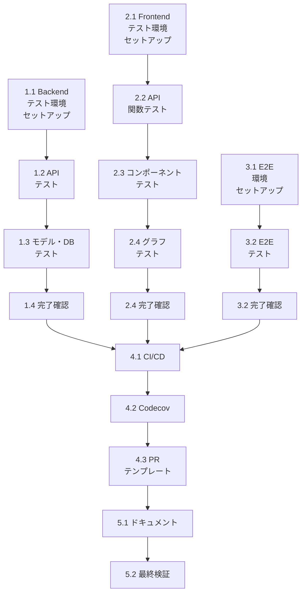

# Feature 7.2: 品質・保守性向上 - 実装計画書

**作成日**: 2026年2月1日  
**対象バージョン**: 0.2.0  
**ステータス**: 計画中

---

## 1. 実装概要

本ドキュメントでは、Feature 7.2「品質・保守性向上」の実装段階における、具体的なタスク分割、工程表、リソース配分を示します。

---

## 2. 実装フェーズ細分化

### Phase 1: Backend ユニットテスト実装（3日間）

#### タスク 1.1: テスト環境セットアップ
**時間**: 0.5日

**内容**:
- requirements.txtにテストツール追加（pytest, pytest-cov, pytest-asyncio, httpx）
- `backend/tests/conftest.py` 作成
  - テスト用インメモリSQLiteデータベース設定
  - FastAPI TestClient setup
  - Fixture定義（db_session, client, サンプルデータ）
- `backend/tests/__init__.py` 作成（パッケージマーク）

**成果物**:
- `backend/tests/conftest.py`
- `backend/tests/__init__.py`
- `backend/requirements.txt` 更新

**確認項目**:
- `pytest --collect-only` で全テストが認識される
- `pytest -v` で正常に実行開始できる

---

#### タスク 1.2: APIエンドポイントテスト実装
**時間**: 1.5日

**内容**:

`backend/tests/test_api.py` 作成

```python
# テスト対象エンドポイント（優先度順）
test_get_entities()
test_create_entity_success()
test_create_entity_missing_required_fields()
test_create_entity_invalid_entity_type()
test_update_entity_success()
test_update_entity_not_found()
test_delete_entity_success()
test_delete_entity_not_found()

test_get_relations()
test_create_relation_success()
test_create_relation_missing_entity()
test_update_relation_success()
test_delete_relation_success()

test_get_entity_types()
test_create_entity_type_success()
test_update_entity_type_success()
test_delete_entity_type_success()

test_get_relation_types()
test_create_relation_type_success()
test_update_relation_type_success()
test_delete_relation_type_success()

test_read_root()
test_export_data()
test_reset_database()
test_import_data_success()
test_import_data_invalid_format()
```

**テストパターン**:
- 正常系: 各CRUD操作の成功ケース
- 異常系: バリデーションエラー、存在しないリソース
- エッジケース: 空リスト、長い名前、特殊文字

**成果物**:
- `backend/tests/test_api.py` (300-400行)

**確認項目**:
- 全テスト成功
- カバレッジ75%以上

---

#### タスク 1.3: モデルバリデーション・DBテスト
**時間**: 0.7日

**内容**:

`backend/tests/test_models.py`:
```python
test_entity_model_valid()
test_entity_model_missing_name()
test_entity_type_model_valid()
test_relation_model_valid()
test_relation_type_model_valid()
test_unique_constraints()
```

`backend/tests/test_db.py`:
```python
test_init_db()
test_reset_db()
test_database_connection()
test_orm_operations()
```

**成果物**:
- `backend/tests/test_models.py` (100-150行)
- `backend/tests/test_db.py` (100-150行)

**確認項目**:
- Total Coverage 80%達成

---

#### タスク 1.4: CI/CDでの自動実行確認
**時間**: 0.3日

**内容**:
- ローカルでのテスト実行確認
- GitHub Actions用の基本的なCI設定作成（後続フェーズ）

**成果物**:
- テスト実行スクリプト（Makefile/package.jsonに記載）

---

### Phase 2: Frontend ユニットテスト実装（3日間）

#### タスク 2.1: テスト環境セットアップ
**時間**: 0.5日

**内容**:
- `frontend/package.json` 更新
  - `@testing-library/react`, `@testing-library/jest-dom`, `@testing-library/user-event`, `@types/jest` 追加
- `frontend/src/__mocks__/` ディレクトリ作成
  - `d3.ts` - D3.js モック
  - `api.ts` - API 関数 モック
- Jest設定確認（create-react-appに含まれている）

**成果物**:
- `frontend/package.json` 更新
- `frontend/src/__mocks__/d3.ts`
- `frontend/src/__mocks__/api.ts`

**確認項目**:
- `npm test -- --coverage --watchAll=false` で実行可能

---

#### タスク 2.2: API関数テスト実装
**時間**: 0.7日

**内容**:

`frontend/src/__tests__/api.test.ts`:
```typescript
describe('API Functions', () => {
  beforeEach(() => {
    // モック初期化
    jest.mock('../api');
  });

  test('fetchEntities - success')
  test('fetchEntities - error')
  test('createEntity - success')
  test('createEntity - validation error')
  test('updateEntity - success')
  test('deleteEntity - success')
  test('fetchRelations - success')
  test('createRelation - success')
  test('fetchEntityTypes - success')
  test('createEntityType - success')
  test('exportData - success')
  test('importData - success')
  test('resetData - success')
});
```

**成果物**:
- `frontend/src/__tests__/api.test.ts` (150-200行)

**確認項目**:
- API関数のモックが適切に機能
- カバレッジ90%以上

---

#### タスク 2.3: コンポーネントテスト実装
**時間**: 1.2日

**内容**:

`frontend/src/__tests__/App.test.tsx`:
- アプリケーション全体のレンダリング
- ノード/エッジの表示
- 基本的なUIインタラクション

`frontend/src/__tests__/EntityModal.test.tsx`:
- フォーム表示
- 入力値の変更
- バリデーション
- 保存、キャンセル動作

`frontend/src/__tests__/RelationModal.test.tsx`:
- リレーション作成フロー
- ドロップダウン選択
- エラーハンドリング

`frontend/src/__tests__/ImportDialog.test.tsx`:
- ファイル選択
- インポート処理
- 成功/エラーメッセージ

`frontend/src/__tests__/TypeManagementDialog.test.tsx`:
- タイプ一覧表示
- タイプ追加・編集・削除
- カラーピッカー

**成果物**:
- `frontend/src/__tests__/App.test.tsx` (100-150行)
- `frontend/src/__tests__/EntityModal.test.tsx` (150-200行)
- `frontend/src/__tests__/RelationModal.test.tsx` (100-150行)
- `frontend/src/__tests__/ImportDialog.test.tsx` (100-150行)
- `frontend/src/__tests__/TypeManagementDialog.test.tsx` (100-150行)

**確認項目**:
- Total Coverage 70%以上達成
- すべてのテストが成功

---

#### タスク 2.4: D3.jsコンポーネント・グラフテスト
**時間**: 0.6日

**内容**:

`frontend/src/__tests__/Graph.test.tsx`:
- グラフコンポーネントのレンダリング
- SVG要素の生成
- D3.js モック経由でのイベントハンドリング

**成果物**:
- `frontend/src/__tests__/Graph.test.tsx` (100-150行)

---

### Phase 3: E2E テスト実装（2日間）

#### タスク 3.1: Playwright環境セットアップ
**時間**: 0.5日

**内容**:
- `e2e/` ディレクトリ構成作成
  ```
  e2e/
  ├── tests/
  ├── fixtures/
  ├── playwright.config.ts
  ├── package.json
  └── tsconfig.json
  ```
- `e2e/package.json` 作成（@playwright/test, ts-node）
- `e2e/playwright.config.ts` 作成
  - ベースURL: http://localhost:3000
  - ブラウザ: chromium, firefox
  - タイムアウト: 30秒
  - レトライ: 2回
- `e2e/fixtures/sample-data.json` 作成

**成果物**:
- `e2e/` ディレクトリ構成
- `e2e/playwright.config.ts`
- `e2e/package.json`
- `e2e/tsconfig.json`

**確認項目**:
- `npx playwright --version` でPlaywrightが動作
- `docker compose up` でサービス起動可能

---

#### タスク 3.2: E2E テストシナリオ実装
**時間**: 1.5日

**内容**:

`e2e/tests/entity-crud.spec.ts` (150-200行)
- 前提: データリセット
- シナリオ1: エンティティ作成
- シナリオ2: エンティティ編集
- シナリオ3: エンティティ削除

`e2e/tests/relation-crud.spec.ts` (150-200行)
- シナリオ1: リレーション作成
- シナリオ2: リレーション編集
- シナリオ3: リレーション削除

`e2e/tests/type-management.spec.ts` (100-150行)
- シナリオ1: エンティティタイプ追加
- シナリオ2: リレーションタイプ追加
- シナリオ3: タイプ削除

`e2e/tests/import-export.spec.ts` (100-150行)
- シナリオ1: データ作成
- シナリオ2: データエクスポート
- シナリオ3: データ削除
- シナリオ4: データインポート

`e2e/tests/graph-interaction.spec.ts` (100-150行)
- シナリオ1: グラフズーム
- シナリオ2: グラフドラッグ
- シナリオ3: ノードクリック

**成果物**:
- `e2e/tests/entity-crud.spec.ts`
- `e2e/tests/relation-crud.spec.ts`
- `e2e/tests/type-management.spec.ts`
- `e2e/tests/import-export.spec.ts`
- `e2e/tests/graph-interaction.spec.ts`

**確認項目**:
- ローカルで全テスト成功
- `docker compose -f docker-compose.test.yml up` で自動テスト実行可能

---

### Phase 4: CI/CD パイプライン構築（2日間）

#### タスク 4.1: GitHub Actions ワークフロー作成
**時間**: 1日

**内容**:

`.github/workflows/ci.yml` 作成（内容は設計書参照）
- Backend: lint → test → coverage upload
- Frontend: lint → test → coverage upload
- E2E: サービス起動 → テスト → レポート保存
- Build: Docker compose build確認
- Quality Gate: 全チェック統合

チェック項目:
- flake8, mypy (Python)
- ESLint, TypeScript type-check (JavaScript)
- pytest + coverage (Backend)
- Jest + coverage (Frontend)
- Playwright (E2E)
- Docker Compose build

**成果物**:
- `.github/workflows/ci.yml` (200-250行)

**確認項目**:
- PR作成でワークフロー自動実行
- 全ステップの成功確認

---

#### タスク 4.2: Codecov連携・バッジ追加
**時間**: 0.5日

**内容**:
- Codecov.io への登録とリポジトリ連携
- `codecov.yml` 作成（オプション）
  - Backend: 80%以上要求
  - Frontend: 70%以上要求
- README.mdにカバレッジバッジを追加
- GitHub リポジトリ設定
  - ブランチプロテクションルール: "Require status checks to pass"

**成果物**:
- `.github/codecov.yml`
- `README.md` 更新（カバレッジバッジ追加）

**確認項目**:
- Codecov.io でカバレッジが表示される
- 低カバレッジでPRが赤くなる

---

#### タスク 4.3: PR テンプレート・ドキュメント整備
**時間**: 0.5日

**内容**:
- `.github/pull_request_template.md` 作成
- `docs/TESTING.md` 作成（テスト実行方法）
- `docs/CI_CD.md` 作成（CI/CD設定説明）

**成果物**:
- `.github/pull_request_template.md`
- `docs/TESTING.md`
- `docs/CI_CD.md`

---

### Phase 5: ドキュメント・検証（1日間）

#### タスク 5.1: テスト実行方法ドキュメント
**時間**: 0.3日

**内容**:
- `docs/TESTING.md` 作成（詳細）
  - ローカルテスト実行方法
  - カバレッジレポート確認方法
  - トラブルシューティング

**成果物**:
- `docs/TESTING.md` (300-400行)

---

#### タスク 5.2: 最終検証・デプロイ
**時間**: 0.7日

**内容**:
- 全テストの実行確認（ローカル）
- GitHub Actionsワークフロー実行確認
- カバレッジレポート確認
- README.md, CONTRIBUTING.md 更新
- CHANGELOG.md に機能追加を記載

**成果物**:
- `README.md` 更新
- `CHANGELOG.md` 更新
- テスト実行ログ

---

## 3. 工程表

```
Week 1 (Mon-Fri)
├─ Day 1 (Mon)
│  ├─ 1.1 Backend テスト環境セットアップ ✓
│  └─ 1.2 API テスト開始
├─ Day 2 (Tue)
│  ├─ 1.2 API テスト継続
│  └─ 1.3 モデル・DB テスト
├─ Day 3 (Wed)
│  ├─ 1.4 Backend テスト完了 ✓
│  ├─ 2.1 Frontend テスト環境セットアップ
│  └─ 2.2 API 関数テスト
├─ Day 4 (Thu)
│  ├─ 2.3 コンポーネントテスト
│  └─ 2.4 グラフテスト
└─ Day 5 (Fri)
   ├─ 2.4 Frontend テスト完了 ✓
   ├─ 3.1 E2E 環境セットアップ
   └─ 3.2 E2E テスト開始

Week 2 (Mon-Wed)
├─ Day 6 (Mon)
│  └─ 3.2 E2E テスト完了 ✓
├─ Day 7 (Tue)
│  ├─ 4.1 GitHub Actions ワークフロー作成
│  ├─ 4.2 Codecov 連携
│  └─ 4.3 PR テンプレート作成
└─ Day 8 (Wed)
   ├─ 5.1 ドキュメント整備
   └─ 5.2 最終検証 ✓
```

**総工期**: 8 営業日 (2週間)

---

## 4. 依存関係



---

## 5. リソース見積もり

| タスク | 時間 | スキル | 備考 |
|--------|------|--------|------|
| 1.1 Backend環境 | 0.5d | Python/pytest | 新規学習必要 |
| 1.2 APIテスト | 1.5d | Python/FastAPI | 既知領域 |
| 1.3 モデル・DBテスト | 0.7d | Python/SQLAlchemy | 既知領域 |
| 1.4 確認 | 0.3d | - | - |
| 2.1 Frontend環境 | 0.5d | TypeScript/Jest | 新規学習必要 |
| 2.2 API関数テスト | 0.7d | TypeScript/Jest | 既知領域 |
| 2.3 コンポーネントテスト | 1.2d | React/RTL | 既知領域 |
| 2.4 グラフテスト | 0.6d | D3.js/Jest | パートナー項目 |
| 3.1 E2E環境 | 0.5d | Playwright | 新規学習必要 |
| 3.2 E2Eテスト | 1.5d | Automation/Playwright | 既知領域 |
| 4.1 GitHub Actions | 1.0d | YAML/CI | 新規学習必要 |
| 4.2 Codecov | 0.5d | DevOps | 新規学習必要 |
| 4.3 PR テンプレート | 0.5d | Markdown | 既知領域 |
| 5.1 ドキュメント | 0.3d | Markdown | 既知領域 |
| 5.2 最終検証 | 0.7d | QA | 既知領域 |
| **合計** | **10d** | - | - |

注: 実装時の学習時間を考慮して、見積もりより2-3日の余裕を持つ

---

## 6. チェックリスト

### Phase 1: Backend ユニットテスト
- [ ] テスト環境セットアップ完了
  - [ ] pytest, pytest-cov, pytest-asyncio インストール
  - [ ] conftest.py 作成完了
  - [ ] テスト実行確認
- [ ] APIエンドポイントテスト完了 (25+ テスト)
  - [ ] CRUD操作全て
  - [ ] エラーハンドリング
  - [ ] バリデーション
- [ ] モデル・DBテスト完了 (8+ テスト)
- [ ] カバレッジ80%以上達成
  - [ ] `pytest --cov=backend --cov-report=html` で確認

### Phase 2: Frontend ユニットテスト
- [ ] テスト環境セットアップ完了
  - [ ] @testing-library/* パッケージインストール
  - [ ] モック設定完了
  - [ ] テスト実行確認
- [ ] API関数テスト完了 (15+ テスト)
- [ ] コンポーネントテスト完了 (40+ テスト)
  - [ ] App, EntityModal, RelationModal, ImportDialog, TypeManagementDialog
- [ ] グラフテスト完了 (5+ テスト)
- [ ] カバレッジ70%以上達成

### Phase 3: E2E テスト
- [ ] Playwright セットアップ完了
  - [ ] インストール確認
  - [ ] playwright.config.ts 作成
- [ ] エンティティCRUD シナリオ完了 (3シナリオ)
- [ ] リレーションCRUD シナリオ完了 (3シナリオ)
- [ ] タイプ管理 シナリオ完了 (3シナリオ)
- [ ] インポート/エクスポート シナリオ完了 (4シナリオ)
- [ ] グラフインタラクション シナリオ完了 (3シナリオ)
- [ ] 全テスト ローカル成功確認

### Phase 4: CI/CD パイプライン
- [ ] GitHub Actions ワークフロー作成完了
  - [ ] Backend lint/test/coverage
  - [ ] Frontend lint/test/coverage
  - [ ] E2E test
  - [ ] Docker build check
  - [ ] Quality gate
- [ ] PR作成で自動実行確認
- [ ] Codecov 連携完了
  - [ ] README にバッジ追加
  - [ ] CodeCov ダッシュボード確認
- [ ] PR テンプレート作成完了
- [ ] ブランチプロテクション設定完了

### Phase 5: ドキュメント
- [ ] docs/TESTING.md 作成完了
- [ ] docs/CI_CD.md 作成完了
- [ ] README.md 更新完了
- [ ] CHANGELOG.md 記載完了
- [ ] CONTRIBUTING.md 更新完了

---

## 7. 成功基準（再掲）

### 定量的
- ✓ Backend ユニットテストカバレッジ: 80%以上
- ✓ Frontend ユニットテストカバレッジ: 70%以上
- ✓ E2E テスト: 16シナリオ (5セット × 平均3-4シナリオ）
- ✓ CI/CD パイプライン: PR時100%自動実行
- ✓ テスト実行時間: ユニットテスト5分以内, E2E 10分以内

### 定性的
- ✓ ドキュメント充実: 新規開発者が独立してテスト実装可能
- ✓ 自動検出: リグレッション自動検出率 95%以上
- ✓ 保守性: テスト追加に必要な時間 30分以内

---

## 8. リスク管理

| リスク | 確率 | 影響 | 対策 |
|--------|------|------|------|
| テスト環境構築遅延 | 中 | 中 | Day1-2で集中フォーカス |
| E2Eテスト不安定 | 中 | 中 | Playwright待機メカニズム活用、リトライ設定 |
| カバレッジ目標未達 | 低 | 中 | エッジケース追加 |
| CI実行時間超過 | 低 | 低 | 並列実行、キャッシュ活用 |

---

## 9. 参考リソース

- [pytest 公式ドキュメント](https://docs.pytest.org/)
- [React Testing Library 日本語](https://testing-library.com/docs/react-testing-library/intro/)
- [Playwright 公式ドキュメント](https://playwright.dev/)
- [GitHub Actions Best Practices](https://docs.github.com/en/actions/guides)

